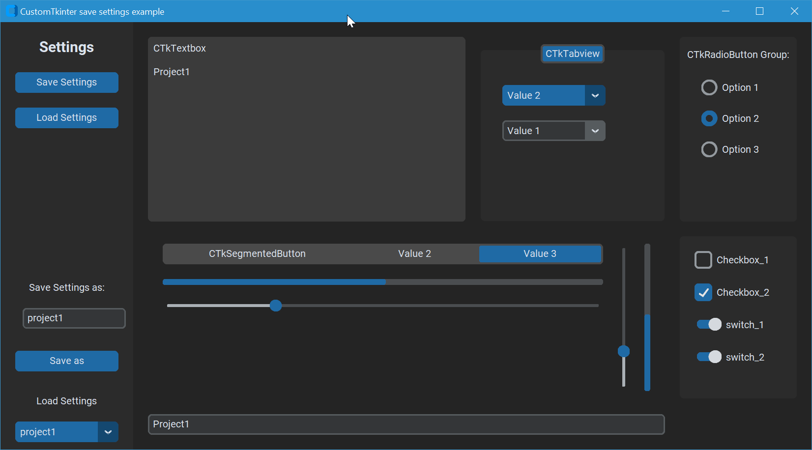
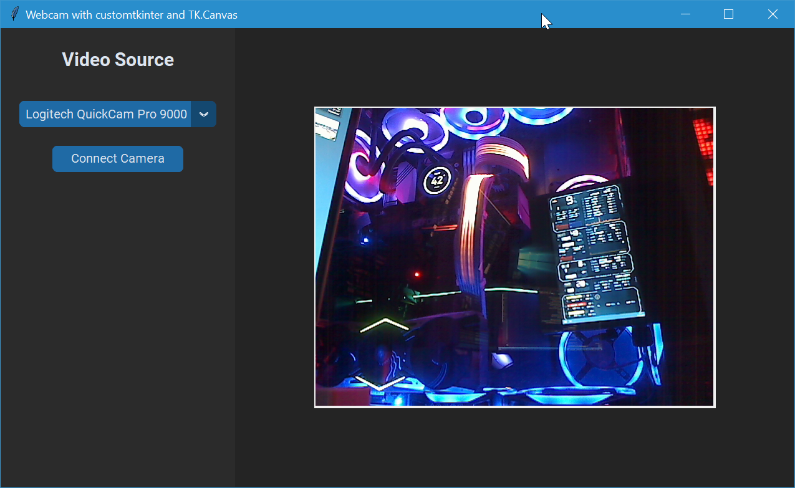
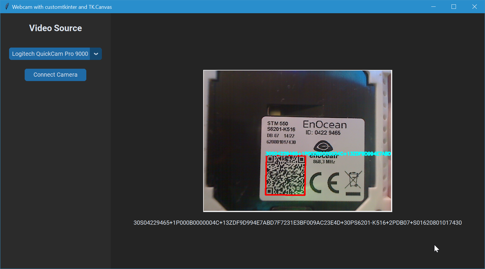

# Python_GUI_Examples
Boilerplates for Python GUI with customtkinter. Tested on Windows only.

# ctk_example_settings

Examples App that demonstrate how to save settings from customtkinter. Save and load default settings, or save and load settings as seperate files.



needed python packages
```shell
pip install tkinter
pip install customtkinter
pip install configparser
pip install base64
```

# ctk_example_webcam

Examples App that demonstrate how to choose and open a webcam in a customtkinter gui with OpenCV with the goal to analyse the image with OpenCV. 



needed python packages
```shell
pip install tkinter
pip install customtkinter
pip install pillow
pip install opencv-python
pip install pygrabber
```

# ctk_example_webcam_qrCode

Examples App that demonstrate how to choose and open a webcam in a customtkinter gui and reads a QR Code from the camera image.



needed python packages
```shell
pip install tkinter
pip install customtkinter
pip install pillow
pip install opencv-python
pip install pygrabber
pip install numpy
pip install pyzbar
```